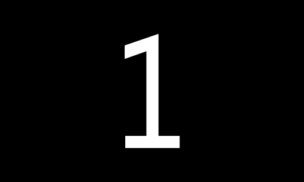
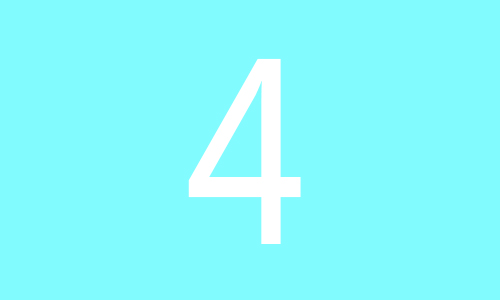

## banner-Swipe
##### 这是一个基于 原生的JavaScript 的 banner滑动插件

***

#### 使用方法
1、  引入 `bannerSwipe.js` 文件  
2、	 HTML 的结构如下  

<!---->	
	<!--整体结构 需要设置id-->
    

    	<ul>
    		<li>
				... content
			</li>
		</ul>
		
		<!--如果需要设置向前向后按钮, 需要设置ID-->
		
		
		
		<!--如果需要分页器 需要设置类名-->
		

			
		

	

3、  初始化函数  

<!---->	 
    bannerSwipe({  

    	//	ID  
		id:"ID",  
		//	设置 banner 长宽  
		size:"500*300",
		//	设置轮播时间,默认 3000(单位:毫秒)  
		timer:2000,  
		//	设置轮播速度,默认 0.5(单位:秒)  
		speed:0.5,
		//	设置循环,默认循环开启  
		loop:true,  
		//	设置自动轮播,默认自动轮播  
		autoplay:true,    
		//	设置向前向后按钮  
		prev:"left",  
		next:"right",  
		//	设定分页器,输入类名  
		pagination:"className"  
	});  
	
4、	CSS 样式 需要设置 整体框架的位置,分页器(分页器 类名为bar的容器 和 该类名下的 a 元素)和按钮

 
##例子
	

		<ul class="banner-swipe">
			<li>
				<!--测试图片-->
				
			</li>
			<li>
				<!--测试图片-->
				
			</li>
			<li>
				<!--测试图片-->
				
			</li>
			<li>
				<!--测试图片-->
				
			</li>
		</ul>
		

		

	

	 
	<button id="left">左</button>
	<button id="right">右</button>
	 
	
	